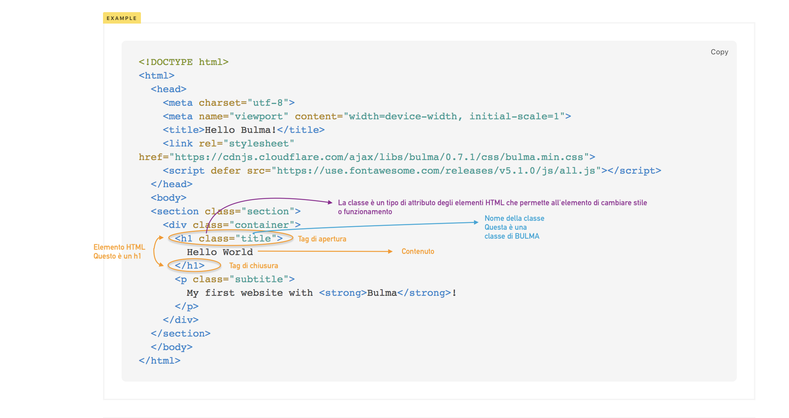
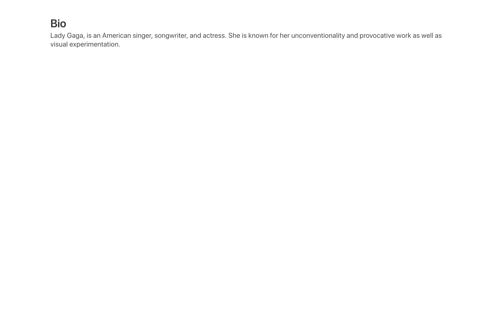

# 02-inizia-a-personalizzare-il-template

| Capitolo precedente                                                                                                                                          | Capitolo successivo                                                                           |
| :--------------------------------------------------------------------------------------------------------------------------------------------------------------- | ---------------------------------------------------------------------------------------------------: |
| [◀︎ 01-comincia-a-preparare-il-tuo-progetto](../01-comincia-a-preparare-il-tuo-progetto)  | [03-modifica-il-layout ▶︎](../03-modifica-il-layout) |

## Obiettivo: 

Personalizzare il template con una piccola biografia

> Le pagine HTML sono costituite da diversi elementi HTML specifici.
>
> Gli elementi, a loro volta, sono costituiti da tag e possono avere degli attributi
>
> I tag HTML etichettano parti di contenuto come "heading", "paragraph", "table" e così via.
>
> I browser non visualizzano i tag HTML, ma li leggono e li usano per rendere leggibile il contenuto della pagina.

<kbd></kbd>

* Sostituisci all'interno dell'elemento `h1` il contenuto **Hello World** con **Bio**
* Puoi vedere il risultato ricaricando la pagina web sul browser 🎉
* Sostituisci il contenuto dell'elemento `p` con una tua breve biografia

<kbd></kbd>

| Capitolo precedente  | Capitolo successivo     |
| :--------------- | ---------------: |
| [◀︎ 01-comincia-a-preparare-il-tuo-progetto](../01-comincia-a-preparare-il-tuo-progetto)| [03-modifica-il-layout ▶︎](../03-modifica-il-layout) |
