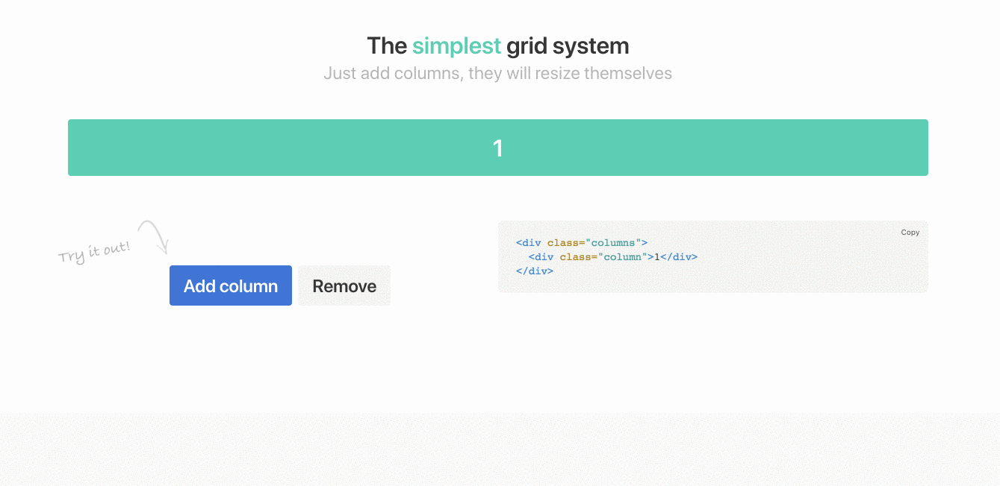
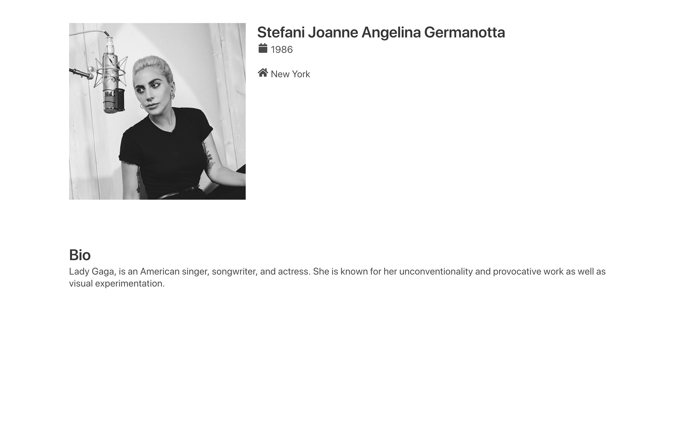

# 06-aggiungi-le-colonne

| Capitolo precedente  | Capitolo successivo     |
| :--------------- | ---------------: |
| [◀︎ 05-aggiungi-la-tua-foto](../05-aggiungi-la-tua-foto)| [07-aggiungi-una-sezione-colorata ▶︎](../07-aggiungi-una-sezione-colorata) |

## Obiettivo:

Dare una forma più solida alla struttura del nostro sito.

- Vai su [Bulma](https://bulma.io/documentation/) e cerca come inserire **2 colonne**

- Copia le colonne subito sotto al `
`
- Nella prima inserisci tutto il tag relativo all’immagine profilo fatto precedentemente
- Nella seconda, inserisci il tuo nome e le icone col testo relative al tuo anno e luogo di nascita
- Ricarica la pagina per vedere il risultato 😍

Come vedrai le colonne hanno la stessa dimensione, ovvero ognuna occupa metà dello schermo.

- Cerca su [Bulma](https://bulma.io/documentation/) le varie classi che si possono aggiungere alle colonne.
- Ad esempio noi abbiamo impostato le proporzioni della prima colonna affinché sia di 1/3 e il testo di 2/3
- Sperimenta con le varie classi e poi osserva il risultato ricaricando la pagina del browser 😍

<kbd></kbd>

| Capitolo precedente  | Capitolo successivo     |
| :--------------- | ---------------: |
| [◀︎ 05-aggiungi-la-tua-foto](../05-aggiungi-la-tua-foto)| [07-aggiungi-una-sezione-colorata ▶︎](../07-aggiungi-una-sezione-colorata) |
