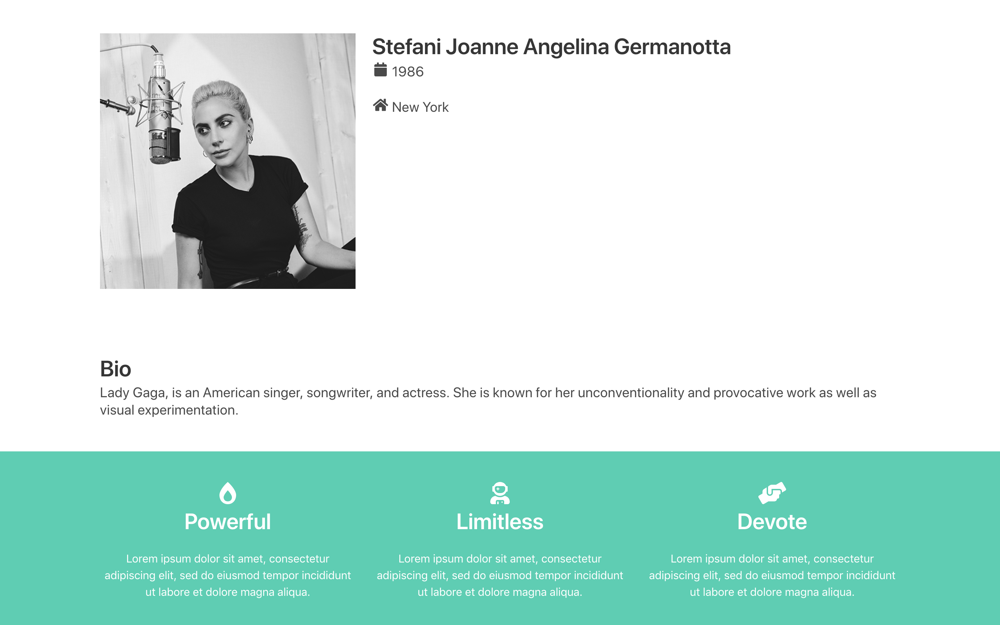

# 07-aggiungi-una-sezione-colorata

| Capitolo precedente  | Capitolo successivo     |
| :--------------- | ---------------: |
| [◀︎ 06-aggiungi-le-colonne](../06-aggiungi-le-colonne)| [08-crea-section-per-esperienze ▶︎](../08-crea-section-per-esperienze) |

## Obiettivo:
Aggiungere una sezione colorata

Anche le sezioni colorate facilitano molto lettura da parte dell'utente che visita il sito, e conferiscono carattere allo stile che si cerca di seguire.
Ora, quindi, proviamo a creare delle sezioni colorate sulla nostra pagina:

- [Bulma](https://bulma.io/documentation/) possiede delle sezioni colorate che si chiamano `hero`
- Cerca su [Bulma](https://bulma.io/documentation/) come inserire un hero verde acqua
- Aggiungi l’hero in fondo, subito sotto alla `section` con la tua descrizione
- Rimuovi il contenuto del `
`
- Aggiungi **3 colonne** della stessa dimensione
- In ogni colonna inserisci un `p` con un’icona
- Cerca su [Bulma](https://bulma.io/documentation/)  come modificare l’icona e renderla più grande
- Aggiungi sotto ad ogni icona un titolo con un aggettivo che ti rappresenta e un sottotitolo con una descrizione.

### Centra il contenuto delle colonne

- Aggiungi classe `has-text-centered` al container per centrare il contenuto di tutte le colonne

<kbd></kbd>

| Capitolo precedente  | Capitolo successivo     |
| :--------------- | ---------------: |
| [◀︎ 06-aggiungi-le-colonne](../06-aggiungi-le-colonne)| [08-crea-section-per-esperienze ▶︎](../08-crea-section-per-esperienze) |
