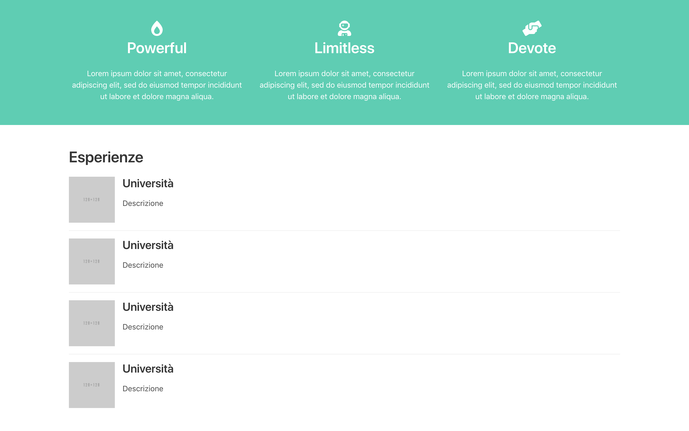

# 08-crea-section-per-esperienze

| Capitolo precedente  | Capitolo successivo     |
| :--------------- | ---------------: |
| [◀︎ 07-aggiungi-una-sezione-colorata](../07-aggiungi-una-sezione-colorata)| [09-crea-una-sezione-contatti ▶︎](../09-crea-una-sezione-contatti) |

## Obiettivo: 
Creare una nuova section.

In base all'intento del sito web, è interessante valutare la possibilità di aggiungere una "sezione esperienze":

- Crea una nuova `section` (`section` + `container`) con un titolo
- Cerca su [Bulma](https://bulma.io/documentation/) l’elemento `media object`
- Aggiungi un `div` con classe  `media-left` e al suo interno inserisci un’immagine
- Sostituisci il valore della `src` dell’immagine, con una tua immagine salvata nella cartella
- Sotto al `media-left` aggiungi un `media-content`
- All’interno del `media-content` crea un `div class="content"`, dove potrai aggiungere un titolo e una descrizione dell’esperienza

Ora hai creato il primo elemento, se ne vuoi aggiungere altri ti basta copiare e sostituire il contenuto 😍

<kbd></kbd>

| Capitolo precedente  | Capitolo successivo     |
| :--------------- | ---------------: |
| [◀︎ 07-aggiungi-una-sezione-colorata](../07-aggiungi-una-sezione-colorata)| [09-crea-una-sezione-contatti ▶︎](../09-crea-una-sezione-contatti) |
