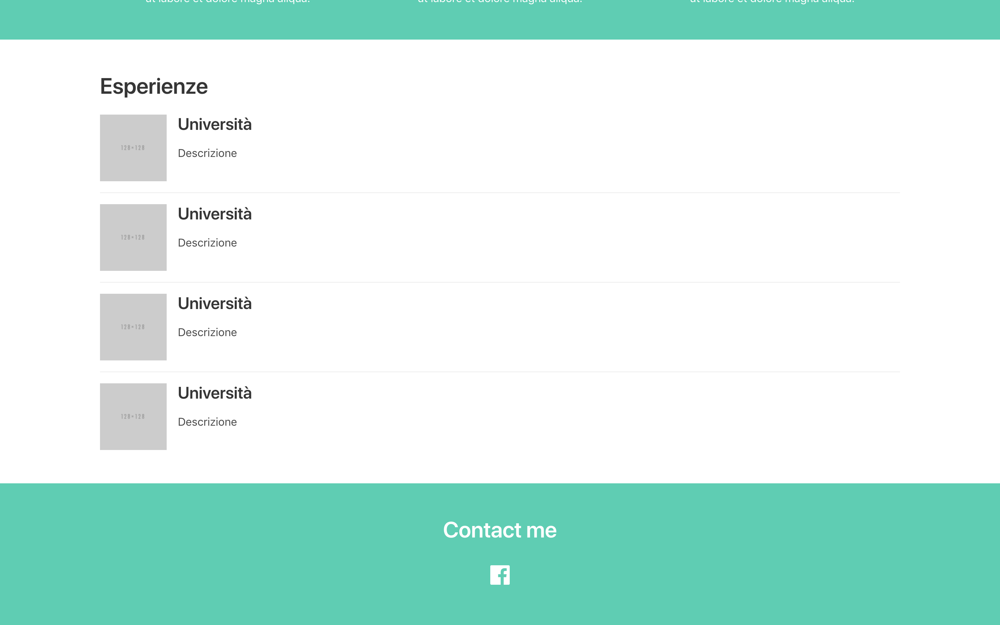

# 09-crea-una-sezione-contatti

| Capitolo precedente                                                    | Capitolo successivo                                        |
| :--------------------------------------------------------------------- | ---------------------------------------------------------: |
| [◀︎ 08-crea-section-per-esperienze](../08-crea-section-per-esperienze) | [10-carica-online-il-sito ▶︎](../10-carica-online-il-sito) |

## Obiettivo:
Creare una sezione contatti

La sezione contatti è una parte molto importante del sito web: questa faciliterà molto la possibilità dell'utente interessato ai contenuti del sito di mettersi in contatto con te, ma soprattutto di mettere in moto il passaparola grazie al collegamento con le reti sociali.

- Crea un nuovo `hero` colorato
- Aggiungi un titolo per indicare che si tratta della sezione contatti
- Aggiungi degli anchor tag `<a href="..."> ... </a>`
  > Un anchor tag è un elemento che permette di creare un collegamento ad altre pagine web
- Inserisci all’interno dell’anchor tag l’icona di Facebook
- Inserisci all’interno di `href` il link al tuo profilo Facebook

Se vuoi, puoi aggiungere degli anchor tag e altri collegamenti ai tuoi social 😍

<kbd></kbd>

| Capitolo precedente                                                    | Capitolo successivo                                        |
| :--------------------------------------------------------------------- | ---------------------------------------------------------: |
| [◀︎ 08-crea-section-per-esperienze](../08-crea-section-per-esperienze) | [10-carica-online-il-sito ▶︎](../10-carica-online-il-sito) |
